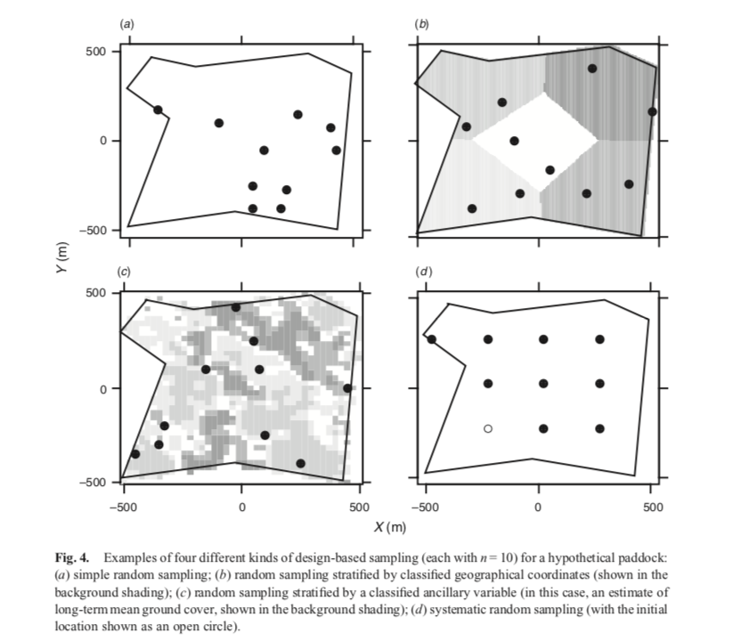

```{r knitr setup, message = FALSE, warning = FALSE, include = FALSE}
knitr::opts_chunk$set(echo = TRUE, message = FALSE, warning = FALSE)
```

```{r packages}
library(tidyverse)
```

## Goals

This notebook serves to describe and implement a simulation to test the procedures currently used to measure soil organic carbon (SOC) against a known groundtruth. Questions to be answered include:

- With what accuracy can we recover true SOC on average (mean squared error)?
- Are estimates of SOC likely to center on the truth (bias)?
- Are estimates of uncertainty (standard errors) reflecting the true degree of uncertainty in the estimates (coverage of confidence intervals / type 1 error rate)? 


## Empirical Input: The Marin Data

Simulations will be based off of samples from Marin County collected by the Silver Lab at UC Berkeley.

```{r duplicate data, message = FALSE}
duplicate_data <- read_csv("mcp_duplicates.csv")
#drop samples that were rerun fewer or more than 2 times
no_dups <- names(which(table(duplicate_data$sample_name) < 2))
#also drop runs of atropine standards
duplicate_data <- duplicate_data %>%
  filter(!(sample_name %in% no_dups)) %>%
  filter(!(substr(sample_name, 1, 4) %in% c('atro','blan','Blan','dumm','Dumm'))) %>%
  group_by(sample_name) %>%
  filter(rank(time) <= 2)

duplicate_data
```

```{r pct carbon}
pct_carbon <- duplicate_data$carbon / 100
hist(pct_carbon, breaks = 30, xlab = "Proportion SOC")
```


### Bulk Density 

In addition to % SOC, bulk density measurements are needed to compute the total amount of SOC in a plot of land. For the time being we treat bulk density as known and fixed across a plot. Ryals et al (2014) report bulk density ranging from .87 to 1.27 g/cm$^3$, based on cores taken from teh walls of a pit, with one pit per plot. We will use 1 g/cm$^3$ as the bulk density in our simulations to compute total SOC.

## Simulating Percent SOC

As a first step, we simulate a "ground truth" (so to speak), which is a 3-dimensional grid on a rectangular prism that represents SOC concentration (in percent) over the plot of land to be studied. The dimensions are `latitude`, `longitude`, and `depth` (in that order). The scale is in meters. 

However, simulating a field of % SOC is not entirely straightforward. In particular we would like to generate numbers that:

- Are bounded between 0 and 1 (0% and 100% SOC).
- Allow for arbitrary correlation between points.
- Have an adjustable mean and variance.


I have explored using a Gaussian copula for this, but for now I will use a beta distribution where the mean is a function varying across space, and besides sharing a similar mean, there is no spatial correlation among close points. The [beta](https://en.wikipedia.org/wiki/Beta_distribution) is a distribution defined on [0,1], often used to model probabilities or proportions. For $X \sim \mbox{Beta}(\alpha, \beta)$ we have:

$$\mathbb{P}(X = x) =  \frac{x^{\alpha - 1} (1-x)^{\beta - 1}}{\mbox{B}(\alpha, \beta)} ~~\mbox{where}~~ \mbox{B}(\alpha,\beta) = \frac{\Gamma(\alpha)\Gamma(\beta)}{\Gamma(\alpha + \beta)}$$
$\Gamma$ is the Gamma function, a generalization of factorial. The beta has mean $\mathbb{E}(X) = \frac{\alpha}{\alpha + \beta}$ and variance $\mathbb{V}(X) = \frac{\alpha \beta}{(\alpha + \beta)^2 (\alpha + \beta + 1)}$

Given a particular mean $\mathbb{E}(X) = \mu$ and variance $\mathbb{V}(X) = \sigma^2$, we can write the parameters in terms of them:

\begin{align*}
\alpha &= \bigg (\frac{1 - \mu}{\sigma^2} - \frac{1}{\mu} \bigg ) \mu^2\\
\beta &= \alpha\bigg (\frac{1}{\mu} - 1 \bigg )
\end{align*}

Note that we must have $\mu \in (0,1)$ and $\sigma^2 < \mu (1 - \mu)$.

We can fit a beta distribution to the marginal distribution of carbon that we find in our duplicates:

```{r beta fit}
#little function to return beta parameters given a mean and variance
compute_beta_params <- function(mu, sigma_squared){
  alpha <- ((1 - mu) / sigma_squared - 1 / mu) * mu^2
  beta <- alpha * (1 / mu - 1)
  c("alpha" = alpha, "beta" = beta)
}

mean_carbon <- mean(pct_carbon)
var_carbon <- var(pct_carbon)
beta_params <- compute_beta_params(mu = mean_carbon, sigma_squared = var_carbon)
grid <- seq(0, max(pct_carbon), by=.001)

hist(pct_carbon, breaks = 30, xlab = "Proportion SOC", freq = FALSE)
points(y = dbeta(grid, shape1 = beta_params[1], shape2 = beta_params[2]), x = grid, type = 'l', col = 'blue', lwd = 2)
```


```{r simulate truth}

simulate_truth <- function(){
  #since silver lab plots are 60 x 25 meters, this gives a resolution of .1 meters
  n_latitude <- 600
  n_longitude <- 250
  #samples are collected at 4 depths: 0-10 cm, 10-30cm, 30-50cm, and 50-100cm
  #ADD DEPTH
  n_depth <- 4
  d <- n_latitude * n_longitude
  
  #first simulate a surface that is a "slope" with the mean decreasing linearly as we move down the surface
  #mean varies across rows, it decreases linearly from .06 to .01
  grid <- (1:n_latitude) / n_latitude
  linear_mean <- .06 * (1-grid) + .01 * grid
  mean_matrix <- matrix(data = rep(linear_mean, n_latitude), nrow = n_latitude, ncol = n_longitude)
  #fix variance initially
  var_matrix <- matrix(.0003, nrow = n_latitude, ncol = n_longitude)
  #simulated carbon matrix
  carbon_matrix <- matrix(0, nrow = n_latitude, ncol = n_longitude)
  for(i in 1:n_latitude){
    for(j in 1:n_longitude){
      beta_params <- compute_beta_params(mu = mean_matrix[i,j], sigma_squared = var_matrix[i,j])
      carbon_matrix[i,j] <- rbeta(n = 1, shape1 = beta_params[1], shape2 = beta_params[2])
    }
  }
  carbon_matrix
}

simulated_surface <- simulate_truth()
```

We can see that the empirical mean over the rows follows the pattern we designated for the true mean. Interestingly the median gets very close to 0 when the mean gets small.


```{r plot simulated surface}
#marginal histogram
hist(simulated_surface, xlab = "Prop Carbon", freq = FALSE)
#means by row
plot(apply(simulated_surface, 1, mean), xlab = "Row", ylab = "Mean Prop Carbon")
#turn to a long dataframe to plot with ggplot
melted_simulated_surface <- reshape2::melt(simulated_surface)
matplot <- ggplot(melted_simulated_surface, aes(x=Var2, y=Var1, fill=value)) + 
  geom_tile() +
  ylab("Latitude (Rows)") +
  xlab("Longitude (Columns)") +
  scale_y_reverse() +
  scale_fill_gradient2(midpoint = 0.05)
matplot
```

The total Carbon in a plot of land, in Megagrams Carbon per hectare (Mg C / ha), is computed from both the percent carbon and the bulk density (a measure of the density of the soil). The bulk density is itself difficult to sample and compute. For the time being we will treat this as fixed and known. From the Silver lab report for California's Fourth Climate Change Assessment, average bulk density across a number of Californian sites was about 1.2 grams per cubic centimeter (g / cm$^3$), which is the number I will use.

```{r total carbon}
#note that our imaginary surface is at the 10 x 10 x 10 cm scale, which is 1000 cubic centimeters.
#this implies a bulk density of 1.2 * 1000 = 1200 grams per grid point. 
bulk_density <- 1200
carbon_mass_surface <- bulk_density * simulated_surface
#total carbon in megagrams
total_carbon <- sum(carbon_mass_surface) * (1e-6)
#a 60 x 25 meter plot is .15 of a hectare
MgC_per_ha <- total_carbon / .15
```

The Mg C / ha in our simulation is `r round(MgC_per_ha)`, which is not very far off from 53 Mg C / ha observed in the Sierra foothills, as observed in [Ryals et al 2014](https://www.sciencedirect.com/science/article/abs/pii/S003807171300312X). In the [CCA4 report](https://www.energy.ca.gov/sites/default/files/2019-07/Agriculture_CCCA4-CNRA-2018-002.pdf), the Silver lab reported stocks of 11 to 108 Mg C / ha across a range of sites in California, with a mean stock of 27 Mg C / ha.

# Sampling 

For our purposes, key features of Silver lab sampling are:

- Plots are 60 by 25 meters.
- Samples are taken along a transect with $n = 9$ samples per plot (sometimes $n=5$ samples per plot). It is not clear if these are randomized at all or merely start at one corner, however I believe the sampling falls under the category of systematic random sampling, i.e. the initial location is random (see figure from Allen et al below).
- Soils are collected using a 7 cm corer, at 4 depths: 0-10 cm, 10-30 cm, 30-50 cm, and 50-100 cm.



We focus on "design based" (random) sampling here. An alternative approach is "model based" sampling, where sample locations are chosen purposively based on prior knowledge in the form of a model (e.g. a variogram). 

Our notation follows Allen et al 2010. Let $\{y_1,...y_n\}$ be $n$ measurements of percent SOC taken within a plot and suppose, for the moment, they comprise a simple uniform random sample from the plot and are measured without error. Then in this simple case unbiased estimates of the mean $\mu_s$, variance $\sigma_s^2$, and variance of the mean $\sigma_s^2(\hat{\mu}_s)$ are given by:

\begin{align*}
\hat{\mu}_s &= \frac{1}{n} \sum_{i=1}^n y_i\\
\hat{\sigma}_s^2 &= \frac{1}{(n-1)} \sum_{i=1}^n y_i\\
\hat{\sigma}_s^2(\hat{\mu}_s) &=  \frac{\hat{\sigma}_s^2}{n} 
\end{align*}


However, Silver lab sampling is not based on simple random sampling. Instead, it is based on systematic random sampling (panel d in the plot above), where the original location is chosen at random and the rest of the locations are sampled along a transect. **Note that the below is not always how they do this. In Ryals et al (2014) they take 3 transects with 3 samples each. It is not clear how these transects are located.**

```{r systematic random sampling}
#function to collect samples from a simulated surface
#inputs:
  #surface: a simulated surface, i.e. a matrix or array with SOC concentrations at each point
#outputs: samples collected along random transects, these are the true values (i.e. with no measurement error)  
collect_sample <- function(surface){
  #start randomly from lower left or lower right hand corner
  left <- sample(c(TRUE, FALSE), size = 1)
  if(left){
    vertical_bounds <- c(nrow(surface)-ceiling(nrow(surface)/10), nrow(surface))
    horizontal_bounds <- c(1,floor(ncol(surface)/10))
  
    initial_location <- c(sample(vertical_bounds[1]:vertical_bounds[2], size = 1), sample(horizontal_bounds[1]:horizontal_bounds[2], size = 1))
    vertical_steps <- floor(seq(0, initial_location[1], length.out = 9))
    horizontal_steps <- floor(seq(0, ncol(surface)-initial_location[2], length.out = 9))
    
    transect <- matrix(c(initial_location[1] - vertical_steps, initial_location[2] + horizontal_steps), nrow = length(vertical_steps))
  } else {
    vertical_bounds <- c(nrow(surface)-ceiling(nrow(surface)/10), nrow(surface))
    horizontal_bounds <- c(ncol(surface),ncol(surface) - floor(ncol(surface)/10))
  
    initial_location <- c(sample(vertical_bounds[1]:vertical_bounds[2], size = 1), sample(horizontal_bounds[1]:horizontal_bounds[2], size = 1))
    vertical_steps <- floor(seq(0, initial_location[1], length.out = 9))
    horizontal_steps <- floor(seq(0, initial_location[2], length.out = 9))
    
    transect <- matrix(c(initial_location[1] - vertical_steps, initial_location[2] - horizontal_steps), nrow = length(vertical_steps))
  }
  true_samples <- simulated_surface[transect]
  true_samples
}
soil_samples <- collect_sample(simulated_surface)
```


# Measurement

Once samples have been taken, error in the assay itself remains a concern. The Silver lab takes duplicate measurements until two runs are within 10% of each other (this often happens after the first two runs of any given sample). These percent differences are computed as:

$$\delta = 100 * \bigg | \frac{x_1 - x_2}{\frac{1}{2}(x_1 + x_2)} \bigg |$$

I add in measurement noise for each point by drawing a random sample from the observed percent differences between the Marin County duplicates, and then adding uniform noise at the scale of the sampled percent difference.

```{r measurement noise}
pct_differences <- duplicate_data %>%
  group_by(sample_name) %>%
  summarize(N_pct_diff = pct_diff(nitrogen), C_pct_diff = pct_diff(carbon), N_abs_diff = abs_diff(nitrogen), C_abs_diff = abs_diff(carbon), C_mean = mean(carbon), N_mean = mean(nitrogen), C_range = abs(diff(carbon)))

hist(pct_differences$C_pct_diff, breaks = 30)

sampled_pds <- sample(pct_differences$C_pct_diff, size = length(soil_samples), replace = TRUE)
#the size of the perturbation is equivalent to the random % difference multiplied by the actual size of each sample. The direction of the perturbation is random.
perturbations <- sample(c(-1,1), size = length(soil_samples), replace = TRUE) * (sampled_pds / 100) * soil_samples

measured_samples <- soil_samples + perturbations
```


# Analysis 

According to [Ryals et al 2014](https://www.sciencedirect.com/science/article/abs/pii/S003807171300312X), the carbon stock in a plot is computed by averaging the samples and then multiplying by the bulk density measurement. These averages are then treated as fixed and analyzed with ANOVA for final inference about treatment effects. 

```{r}
plot_average <- mean(measured_samples * bulk_density)
```

